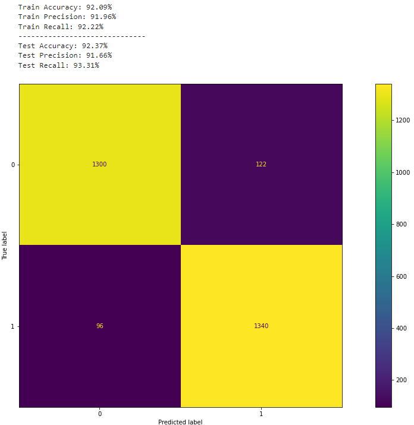
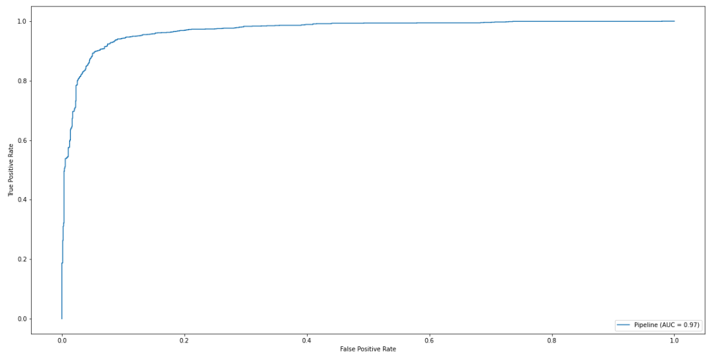

# Phishing Detector Capstone
- Coded by Peter Vuong

---
# Table of Contents
 - [Overview](#1-overview)
 - [Business Understanding](#2-business-understanding)
 - [Data](#3-data)
 - [Modeling](#4-modeling)
 - [Evaluation](#5-evaluation)
 - [Conclusion](#6-conclusion)
 - [Repo Navigation](#repo-navigation)
---
## 1. Overview
---
This project aims to build a classification model to accurately identify what a phishing website is. The dataset used has came from Mendeley that initially has 87 features and 11,430 rows of data. This data was collected from 2020 and published in June 2021.

---
## 2. Business Understanding
---

Phishing is a type of cyber-attack that is engineered to steal user data that often includes login credentials, bank accounts, credit card numbers, and much more personal and sensitive information. Phishing attacks are particularly predatory against older people who are often not as familiar with technology.  
 
The stakeholder for this project is the **Anti Phishing Working Group (APWG)**. APWG is one of the world's leading companies in the fight against cybercrimes. The goal of this project is to create a model that would help in accurately identifying phishing websites as well as identifying common features that are often associated with said phishing websites.

---
## 3. Data
---
The data that I am utilizing came from a study on [Mendeley data](https://data.mendeley.com/datasets/c2gw7fy2j4/3) about phishing websites 
**Data Limitations:**
- This data only contains data on URLs and does not include other common cyber attack avenues such as emails or SMS text messaging.
- This data is from 2020. A lot has happened in the past two years, and cyber attacks have evolved alongside with technological improvements so the data may not be reflective of current phishing features and techniques.
- A good portion of the features extracted from the dataset lack a data-dictionary to explain what some features mean. 
 

The target variable in this project is the `status` column where it is split into `phishing` or `legitimate`. The target data is split evenly. There are 87 features that are in the initial dataset.

---
## 4. Modeling
---
Our initial model is a DummyClassifier model that gives us a raw estimation of whether a website would be classified as phishing or not. I focused on accuracy and recall as my evalution metrics. Recall is important to this project because it assists in identifying the false negatives in the dataset. A false negative in this project would be if the model identifies an observation as a legtimate website when in reallty it actually is a phishing website.  
 
The training accuracy and recall score are about 50% for each score, which is what we are expecting. The final model is a LogisticRegression model with optimal hyperparameters from the GridSearchCV function that focuses on the top 10 features identified from the ExtraTreesClassifier model. The final model produced an accuracy score of 92% and a recall score of 93%. This final model also produced an AUC curve with a score of 0.97.

---
## 5. Evaluation
---

The model that performed best was the model that utilized the features identified through the ExtraTreeClassifier and the optimized hyperparamters of the GridSearchCV. This model produced an accuracy score of **92%** and a recall score of **93%**. The model also produces an AUC score of **0.97**, meaning that it has high classification accuracy.  
 
This model works well with the given data, and it has the potential to become a tool to help protect people against phishing attacks. 
I identified some important features such as the `google_index` and the `phish_hints`. If a feature lacks a `google_index`(1), then the website is 20x more likely to be a phishing website. Similarly, if a website URL has `phish_hints` features, it is ~5x as likely to be a phishing website.

---
## 6. Conclusion
---
Overall, this final model has high potential in helping the AGSW in identifying phishing websites. This model can be used in tandem with the research that AGSW conducts to better identify phishing websites and protect those who would be susceptible to these kinds of cyber attacks.  
 
Based on the data, I would recommend that:
- Make sure the Google Index is accessible for people to utilize as a resource to check credibility
- Educate the population on common phishing website characteristics identified in the project so that they may be vigilant against cyber attacks.
- Stay up-to-date with new phishing techniques (such as brand impersonation, remote work surveys, fake IT emails, etc.)
 
 
Some future actions I would like to consider:
- Utilize this model as a basis for tackling scam and phishing attacks that utilize text messages and phone calls instead of the traditional websites.
- Implement this model in a web program where people can input URLS and get an output of how likely a website is to be phishing or not.
- Utilize this model as a basis for phishing detection for other languages and nuances that may be country-specific.

## Repo Navigation
---

├── [data/](https://github.com/petercvuong/Phishing-Detector-Capstone/tree/main/data)    -------------------------------------> Data used for this project collected by data.world.

├── [images/](https://github.com/petercvuong/Phishing-Detector-Capstone/tree/main/images) --------------------------------------> All images used in the notebook and README.md.

├── [.gitignore](https://github.com/petercvuong/Phishing-Detector-Capstone/blob/main/.gitignore) ---------------------------------> .gitignore used for the project.

├── [Final_Notebook - Jupyter Notebook.pdf](https://github.com/petercvuong/Phishing-Detector-Capstone/blob/main/Final%20Phishing%20Capstone%20Notebook%20-%20Jupyter%20Notebook.pdf)            ---> A PDF of the final project notebook.

├── [Final Phishing Capstone Notebook.ipynb](https://github.com/petercvuong/Phishing-Detector-Capstone/blob/main/Final%20Phishing%20Capstone%20Notebook.ipynb)              ---------------------> The jupyter notebook containing the finalized code.

├── [Web Phishing Detector Presentation.pdf](https://github.com/petercvuong/Phishing-Detector-Capstone/blob/main/Web%20Phishing%20Detector%20Presentation.pdf)              --------------------------> A PDF of the presentaion.

├── [README.md](https://github.com/petercvuong/Phishing-Detector-Capstone/blob/main/README.md)              ------------------------------> README.md for the project (you are here now).