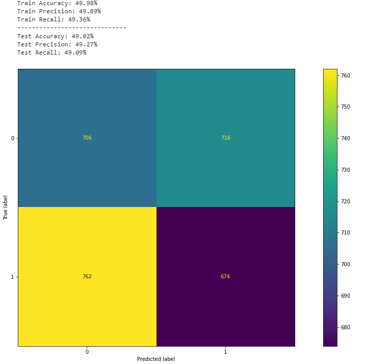
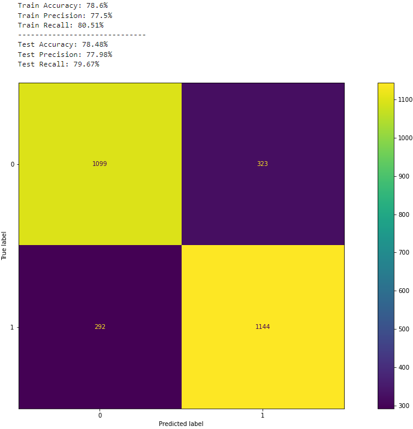

# Phishing Detector Capstone
- Coded by Peter Vuong

---
## Table of Contents
---
### 1. Overview
### 2. Business Understanding
### 3. Data
### 4. Modeling
### 5. Evaluation

---
## 1. Overview
---
This project aims to build a classification model to accurately identify what a phishing website is. The dataset used has came from Mendeley that initially has 87 features and about 12,000 rows of data. This data was collected from 2020.

---
## 2. Business Understanding
---
Phishing is a type of cyber-attack that is engineered to steal user data that often includes login credentials, bank accounts, credit card numbers, and much more personal and sensitive information. Phishing attacks are particularly predatory against those who are not as technilogically literate such as older people like my parents. The goal of this project is to identify phishing websites and what features are the most important in identifying these websites.

---
## 3. Data
---
The data that I got came from a study on [Mendeley data](https://data.mendeley.com/datasets/c2gw7fy2j4/3) about phishing websites. The target variable in this project is the `status` column where it is split into `phishing` or `legitimate`. The target data is split evenly. There are 87 features that are in the initial dataset.

---
### 4. Modeling
---
Our initial model is a DummyClassifier model that gives us a raw estimation of whether a website would be classified as phishing or not. I focused on accuracy and recall as my evalution metrics. Recall is important to this project because it assists in identifying the false negatives in the dataset. A false negative in this project would be if the model identifies an observation as a legtimate website when in reallty it actually is a phishing website. Below you will see the confusion matrix and training/test scores of the DummyClassifier model. The training accuracy and recall score are about 50% for each score, which is what we are expecting.

Our next model that we implement after this DummyClassifier is a LogisticRegression model. A LogisticRegression model excels in classification of binary targets. This LogisticRegression model has 1000 max iterations. This model produced an accuracy score of 78% and a recall score of 79%.

