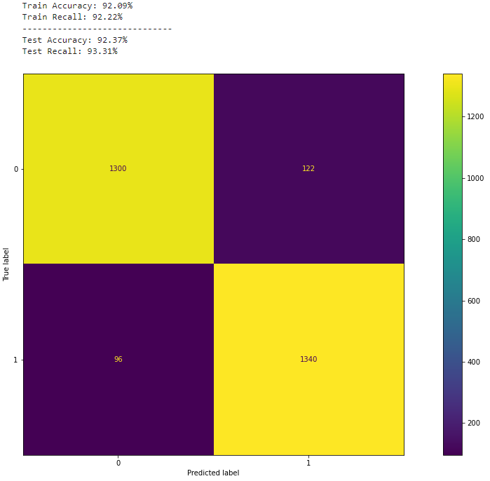

# Phishing Detector Capstone
- Coded by Peter Vuong

---
## Table of Contents
---
### 1. Overview
### 2. Business Understanding
### 3. Data
### 4. Modeling
### 5. Evaluation

---
## 1. Overview
---
This project aims to build a classification model to accurately identify what a phishing website is. The dataset used has came from Mendeley that initially has 87 features and about 12,000 rows of data. This data was collected from 2020.

---
## 2. Business Understanding
---
Phishing is a type of cyber-attack that is engineered to steal user data that often includes login credentials, bank accounts, credit card numbers, and much more personal and sensitive information. Phishing attacks are particularly predatory against those who are not as technilogically literate such as older people like my parents. The goal of this project is to identify phishing websites and what features are the most important in identifying these websites.

---
## 3. Data
---
The data that I got came from a study on [Mendeley data](https://data.mendeley.com/datasets/c2gw7fy2j4/3) about phishing websites. The target variable in this project is the `status` column where it is split into `phishing` or `legitimate`. The target data is split evenly. There are 87 features that are in the initial dataset.

---
### 4. Modeling
---
Our initial model is a DummyClassifier model that gives us a raw estimation of whether a website would be classified as phishing or not. I focused on accuracy and recall as my evalution metrics. Recall is important to this project because it assists in identifying the false negatives in the dataset. A false negative in this project would be if the model identifies an observation as a legtimate website when in reallty it actually is a phishing website. The training accuracy and recall score are about 50% for each score, which is what we are expecting. The final model is a LogisticRegression model with optimal hyperparameters from the GridSearchCV function that focuses on the top 10 features identified from the ExtraTreesClassifier model. The final model produced an accuracy score of 92% and a recall score of 93%. This final model also produced an AUC curve with a score of 0.97.

---
### 5. Evaluation
---
The model that performed best was the model that utilized the features identified through the ExtraTreeClassifier and the optimized hyperparamters of the GridSearchCV. This model produced an accuracy score of **92%** and a recall score of **93%**.  
The model also produces an AUC score of **0.97**, meaning that it has high classification accuracy.  
This model works well with the given data, and it has the potential to become a tool to help protect people against phishing attacks. 
I identified some important features such as the `google_index` and the `phish_hints`. If a feature lacks a `google_index`(1), then the website is 20x more likely to be a phishing website. Similarly, if a website has `phish_hints` features, it is ~5x as likely to be a phishing website.
---
### 6. Conclusion
---
Overall, this final model has high potential in helping the AGSW in identifying phishing websites. This model can be used in tandem with the research that AGSW conducts to better identify phishing websites and protect those who would be susceptible to these kinds of cyber attacks. 
Some future actions I would like to consider is:
- Utilize this model as a basis for tackling scam and phishing attacks that utilize text messages and phone calls instead of the traditional website.
- Implement this model in a website or application where people can input URLS and get an output of how likely a website is to be phishing or not.
- Utilize this model as a basis for phishing detection for other languages and nuances that may be country-specific.

